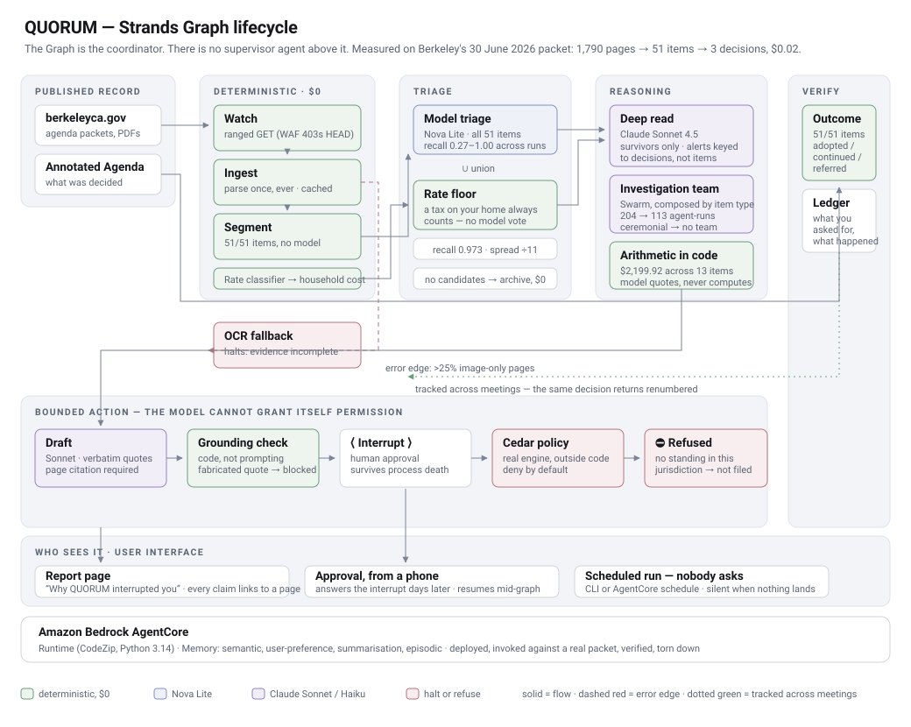

<p align="center">
  
</p>

<p align="center">
  <em>Your city publishes hundreds of pages a week.<br>
  QUORUM reads all of it, and tells you the one paragraph that lands on your street.</em>
</p>

<p align="center">
  <a href="https://quorum-civic-agent.vercel.app/"><b>Live demo</b></a> &nbsp;·&nbsp;
  <a href="#architecture"><b>Architecture</b></a> &nbsp;·&nbsp;
  <a href="#verify-this-yourself-in-90-seconds"><b>Verify it yourself</b></a> &nbsp;·&nbsp;
  <a href="notes/engineering-log.md"><b>Engineering log</b></a>
</p>

<p align="center">
  <sub>Built with the <a href="https://strandsagents.com">Strands Agents SDK</a> and
  Amazon Bedrock AgentCore · MIT licensed</sub>
</p>

---

## The problem

Berkeley City Council's agenda packet for 30 June 2026 is **1,790 pages**. It was
published days before the vote. It contains thirteen separate taxes levied on a
single home, a parking ordinance that changes one household's street, and a
police surveillance policy that had been quietly rewritten since May.

Almost nobody reads it. The local newsrooms that used to are gone. Public comment
opens and closes with hardly anyone informed enough to use it.

That is routine, repetitive, background work a person is supposed to do every
week and never does. QUORUM does it, unprompted, for **$0.02 a run** — and says
nothing at all in the weeks when nothing affects you.

---

## Verify this yourself in 90 seconds

QUORUM's central claim is that it tracks a decision as it changes between
published documents. Here is that claim, checkable without running any code:

1. Open the [7 May 2026 packet](https://berkeleyca.gov/sites/default/files/city-council-meetings/2026-05-07%20Revised%20Special%20Agenda%20Packet%20-%20Council%20-%20WEB.pdf)
   (176 pages) and search for `repositioned to capture an area` — **not there.**
2. Open the [30 June 2026 packet](https://berkeleyca.gov/sites/default/files/city-council-meetings/2026-06-30%20Agenda%20Packet%20-%20Council%20-%20WEB.pdf)
   (1,790 pages) and search the same string — **pages 1395, 1402, 1413, 1415.**

Two public PDFs, two months apart, and a diff. No mock data, no API, nothing
staged.

---

## What it found

In May, Berkeley's Public Safety Policy Committee reviewed a police surveillance
use policy and made **eleven specific requests**. One was simple: tell camera
owners when police access their footage.

The department's response, 30 June packet, **page 1394**:

> "the Department will include in the RFP a request for vendors to describe the
> **feasibility** of notifying camera owners each time BPD personnel access their
> feed. **This is not a minimum requirement for vendor selection** but will be
> evaluated as a value-added feature…"

The committee asked for a **process**. What appeared was a **non-binding
feasibility question to vendors**. The provision was not deleted — it was
demoted. Anyone skimming would think the request had been granted.

The council then adopted it **as presented** — Resolution 72,369-N.S., 17
speakers, Annotated Agenda page 19.

QUORUM also verified what *was* added: six substantive new safeguards, including
a First Amendment protection barring monitoring of lawful protests, and a
72-hour notification requirement if a federal agency is given camera data.

**That is the product.** Not "here is a summary" — *here is what you asked for,
and here is what happened to it.*

---

## What it does

| | |
|---|---|
| **Watches** | Detects newly published packets. Berkeley's WAF rejects `HEAD`, so it probes with a ranged `GET`. |
| **Parses** | 1,790 pages → 51 agenda items, deterministically, at zero model cost. Each packet is parsed exactly once, ever. |
| **Matches stakes** | Cheap model over every item, expensive model over the few that survive. Alerts are keyed to *decisions*, not agenda items. |
| **Computes** | Totals what a meeting costs one household — in code, never in the model. |
| **Tracks identity** | Resolves the same decision across meetings when it is renumbered, recalendared, and finally given an ordinance number. |
| **Diffs** | Compares enacting text between published versions and separates substance from page furniture. |
| **Refuses** | Drafts a public comment, verifies every claim against the source, asks a human — then asks Cedar, which can still say no. |
| **Verifies** | Reads the Annotated Agenda afterwards and reports what the council actually did. |

---

## Results, measured

Everything below is reproducible from the scripts in this repository.

**Attention efficiency** on the 30 June packet:

```
1,790 pages  →  51 agenda items  →  ~14 candidates  →  2–3 decisions      $0.02
```

**Retrieval quality**, 5 trials against a [hand-labelled key](eval/labels_2026-06-30.json):

| | model triage alone | + deterministic rate floor |
|---|---|---|
| precision | 1.000 | 1.000 |
| recall (mean) | 0.787 | **0.973** |
| recall (range) | **0.267 – 1.000** | 0.933 – 1.000 |

The finding is the **variance**, not the mean. Two of five trials scored a
perfect 1.000; one caught 4 of 15 relevant items, overlooking eleven taxes levied
on the household's own home. A single run would have looked like a working
system. Rate-bearing items now bypass model triage entirely — *a tax on your home
affects you whether or not a model notices* — which cuts recall spread by 11×.

**Household cost** for a 1,450 sq ft home assessed at $1.2M:

```
per sq ft of dwelling   $1.11167/sqft  × 1,450       = $1,611.92
percent of assessed     0.0490%        × $1,200,000  =   $588.00
                                                       ──────────
                                                       $2,199.92   across 13 items
```

Adding every rate that says "per square foot" instead gives $3,529.28 —
overstating by **$1,329.36 a year**, because the largest such rate on the page
applies only to large non-profits. Getting this right requires distinguishing
three rate bases across fifteen items.

---

## Architecture

The `Graph` is the lifecycle coordinator; there is no supervisor agent layered on
top of it. Colour shows what costs money.



Three design decisions worth defending:

**Deterministic where it can be.** Fetching, parsing, segmenting, rate
classification, identity resolution, grounding checks and arithmetic are all
plain Python. They cost nothing and are auditable. Identity in particular is
never decided by a model, because identity must be explainable.

**Models only where reasoning is required**, routed by cost: Nova Lite over all
51 items, Claude Sonnet 4.5 over the handful that survive. One pass of this
packet through a frontier model would cost ~$3.80 in input alone; the routed
pipeline costs $0.02.

**The model never computes the number it reports.** When it was allowed to, it
reported $0.89/sq ft against a true $1.11167 — confidently, and not obviously
wrong on the page.

| Module | Role |
|---|---|
| [`ingest.py`](src/quorum/ingest.py) | Fetch and parse once, ever. Provenance on every page. |
| [`segment.py`](src/quorum/segment.py) | Structural segmentation into agenda items. No model. |
| [`stake.py`](src/quorum/stake.py) | Triage and decision-level alerts: WHAT / WHY YOU / WHY NOW / EVIDENCE |
| [`cost.py`](src/quorum/cost.py) | Rate classification and household totals, with provenance |
| [`lineage.py`](src/quorum/lineage.py) | Cross-meeting identity resolution and enacting-text diff |
| [`investigate.py`](src/quorum/investigate.py) | Investigation teams composed from the item type |
| [`action.py`](src/quorum/action.py) | Draft, grounding verification, interrupt, policy gate |
| [`policy.py`](src/quorum/policy.py) · [`quorum.cedar`](policy/quorum.cedar) | Cedar evaluation |
| [`outcomes.py`](src/quorum/outcomes.py) | What the council actually decided |
| [`evaluate.py`](src/quorum/evaluate.py) | Precision, recall, and run-to-run variance |
| [`pipeline.py`](src/quorum/pipeline.py) | The Strands `Graph` |

---

## It cannot act on its own

QUORUM drafts public comments. It cannot file one.

Every submission passes through a [Cedar policy](policy/quorum.cedar) evaluated by
the **real Cedar engine**, outside agent code — a human must approve, the approval
must be under 24 hours old, every assertion must cite a packet page, one comment
per meeting, and the identity must have **standing in that jurisdiction**.

That last rule refuses this project's own author. QUORUM is built from India;
filing into a Berkeley meeting on an item its operator has no stake in *is*
astroturfing. So the demo shows the policy engine blocking its own author:

```
DRAFT      3 verbatim quotes, all cited (packet p.3)
GROUNDING  3/3 quotes verified, 0 uncited claims
INTERRUPT  "Approve filing this comment into the public record?"
APPROVED   resumed mid-tool, in a different OS process
CEDAR      BLOCKED — no verified standing in this jurisdiction
OUTCOME    comment prepared, not filed
```

> **The model can recommend an action. It cannot grant itself permission to take
> one — including when the operator is us.**

---

## Running it

```bash
python -m venv .venv
.venv/Scripts/pip install -r requirements.txt
aws configure                          # region us-west-2

python scripts/run_graph.py            # full pipeline on a real packet
python scripts/build_lineages.py       # cross-meeting identity resolution
python scripts/household_cost.py       # the cost breakdown, with provenance
python scripts/run_action.py           # draft → interrupt → Cedar refusal
python scripts/verify_outcomes.py      # what the council actually did
python scripts/run_eval.py             # precision, recall, variance
python scripts/build_report.py         # regenerate the report page
```

Needs Bedrock access to `us.anthropic.claude-sonnet-4-5-*`,
`us.anthropic.claude-haiku-4-5-*` and `us.amazon.nova-lite-v1:0` in `us-west-2`.

**Deploying to AgentCore**: `cd deploy && agentcore deploy --yes`, then
`python scripts/teardown.py` to check nothing is left billing. Verified
end to end — see [deployment evidence](notes/deployment-evidence.md).

---

## Honest limitations

- **Triage recall varies between runs.** Mitigated by a deterministic rate floor,
  not solved. Ballot measures that levy a tax are not yet covered by the floor.
- **Special-meeting packets are not segmented** — they number items `1a`/`1b`.
- **The OCR fallback does not OCR.** The error edge fires and the run halts with
  "evidence incomplete" rather than reasoning over text it cannot verify.
- **One jurisdiction, one household profile, one labeller.** Depth over breadth
  is the honest claim.
- **Nothing has ever been filed**, by design.

---

## Licence

MIT — see [LICENSE](LICENSE).
